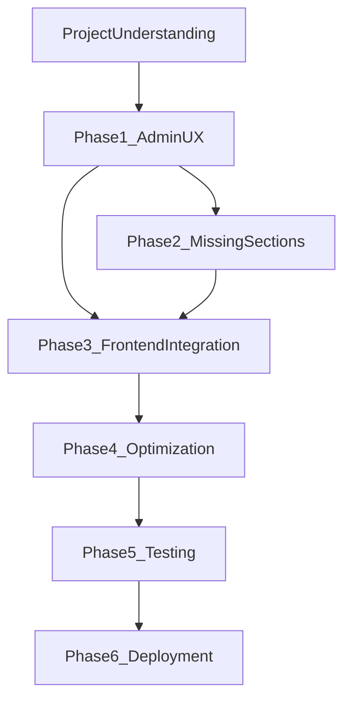

# Balaji Events Platform — Master Plan

**Generated:** 2026-08-04  
**Companion:** [`PROJECT_UNDERSTANDING.md`](./PROJECT_UNDERSTANDING.md)  
**Mode:** Planning only — no application code modified except this document and `PROJECT_UNDERSTANDING.md`.

---

## Goal

Ship **Version 1.0** as a production Website Control Panel + public site without rework:

- Admin labels match website sections
- No hardcoded marketing content where APIs already exist
- New modules only when data cannot live in existing models
- Stable APIs for future mobile apps
- Validate and commit after each phase; wait for approval before the next

---

## Zero-Rework Strategy

1. **Reuse first** — Setting, Home aggregator, ContentCache, SeoService, existing Resources/composables.
2. **Wire before inventing** — `featured_blog`, `featured_faqs`, `/api/faqs`, `/api/blog`, `/api/contact`, `/api/seo/resolve` already exist.
3. **Rename, don’t rename architecture** — Filament labels/groups only; keep model/table/route/resource namespaces.
4. **One write path for leads** — All enquiry forms → `POST /api/contact` (extend fields only if required).
5. **No parallel APIs** — No “v2 home” or mobile-only duplicates; version later as `/api/v1` if breaking changes become unavoidable.
6. **UI freeze** — Match Bootstrap reference; no redesign.
7. **Phase gates** — Lint/typecheck/build (FE) + pint/tests/route sanity (BE) → commit → stop → approve.

---

## What Should Never Be Changed

| Area | Rule |
|------|------|
| Existing public API shapes | Additive fields only; no breaking renames |
| DB table / column names for shipped modules | No drive-by renames |
| Model / Controller / Resource class namespaces | Keep |
| Bootstrap-matched frontend layout/CSS intent | No redesign |
| `GET /api/home` as homepage aggregator | Keep as primary home contract |
| ContentCache key strategy | Extend keys; don’t invent a second cache layer |
| Separate FE/BE git repos | Commit per repo with clear messages |

---

## What Can Be Reused

| Asset | Reuse for |
|-------|-----------|
| `Setting` singleton | Contact page content, Footer, SEO admin pages, About short copy |
| `GET /api/home` | Homepage SSR; menus on `/` |
| `GET /api/services` (+ show) | Services pages, Hero Search options, related services |
| `GET /api/gallery` | Gallery page + home featured |
| `GET /api/blog` (+ `featured_blog`) | Homepage Latest News + blog pages |
| `GET /api/faqs` (+ `featured_faqs`) | FAQ page + optional home FAQ |
| `POST /api/contact` | Contact, service inquiry, share-story (mapped fields) |
| `SeoService` + `/api/seo/resolve` | Global page meta + JSON-LD |
| `ContentCache` + observer | Any new public list/home payloads |
| `HasPublicStorageUrl` | New image-bearing models |
| Filament Resource pattern | New CMS modules (Testimonials, etc.) |
| `useApiBase` / `useFetch` keys | New composables (`useFaqs`, `useBlog`, `useContact`) |

---

## Remaining Work (Priority Order)

| # | Work item | Depends on | Est. phase |
|---|-----------|------------|------------|
| P0 | Admin UX: nav labels/groups, 4-tab forms, tables, widgets, hide category nav | None | Phase 1 |
| P0 | Wire contact forms → `POST /api/contact` | None | Phase 3 |
| P0 | Wire Latest News → `featured_blog` / blog API | None | Phase 3 |
| P0 | Wire FAQ page → `/api/faqs` | None | Phase 3 |
| P0 | Wire About/Contact/Footer content from `settings` | Optional Setting-backed admin pages | Phase 1–3 |
| P1 | Testimonials (Client Says) CMS + API + FE | Design fields once | Phase 2–3 |
| P1 | Events Overview CMS or curated mapping | Product decision: new model vs services | Phase 2–3 |
| P1 | About CMS if settings fields insufficient | Phase 1 Setting UX | Phase 2–3 |
| P1 | Blog list + detail pages | Blog API | Phase 3 |
| P1 | SEO FE: resolve, JSON-LD, canonical, analytics, correct SITE_URL | SeoService | Phase 3–4 |
| P2 | Newsletter subscribers | New model | Phase 2–3 |
| P2 | UserResource + panel access hardening | User model | Phase 1 (users) / Phase 4 (roles) |
| P2 | Roles & Permissions package | Product decision | Phase 4+ |
| P2 | Cache detail endpoints; FAQ select trim; image LCP fixes | None | Phase 4 |
| P3 | Feature/API/Playwright tests | Stable contracts | Phase 5 |
| P3 | Production deploy (ENV, queue, SSL, CF, backups, guide) | App complete | Phase 6 |

---

## Dependencies (Graph)



- Phase 3 can start wiring **existing** APIs in parallel with Phase 2 only for sections that already have backends (blog, FAQ, contact, settings).
- Testimonials / Events Overview / Newsletter **require** Phase 2 before FE dynamic wiring.
- Do not run Phase 6 until Phase 5 gates pass.

---

## Phase-Wise Execution Plan

### Phase 1 — Admin Panel Improvement

**Do not change:** database, models, controllers, routes, APIs, frontend.

**Do:**

- Navigation groups: Website, CRM, System, Users
- Rename labels: Slider, Latest News, FAQ, Contact Enquiries, Website Settings
- Move Website Settings → System; add Setting-backed pages for Contact, Footer, SEO (reuse SettingForm field groups)
- Hide category resources from main nav
- UserResource on existing User model
- Forms ≤ 4 tabs: General, Media, SEO, Publish
- Table badges, filters, search, bulk actions, empty states
- Dashboard: remove FilamentInfoWidget; add stats + quick actions
- Consistent Heroicon set (Filament native)

**Defer to Phase 2:** About, Events Overview, Client Says, Newsletter, Roles.

**Exit criteria:** Admin works; no API/DB/route contract changes; commit `refactor(admin): improve navigation and ux`.

---

### Phase 2 — Missing Website Sections

**Create only if missing** (no demo stubs):

| Section | Approach |
|---------|----------|
| About | Prefer Setting/`company_*` expansion or thin About model if media-rich |
| Events Overview | Prefer curated records or mapped Services; avoid duplicate gallery |
| Client Says | New Testimonial model + Filament + API + home key |
| Newsletter | Subscriber model + `POST` endpoint + Filament CRM list |
| Hero Search | No new backend if services list suffices |

Reuse Filament patterns, ContentCache, HasPublicStorageUrl, HomeResource extension.

**Exit criteria:** Admin + API for new modules; home payload extended additively; commit per module or one coherent commit.

---

### Phase 3 — Frontend Integration

**Rule:** No hardcoded marketing content where API exists. No UI redesign.

- Home: Latest News ← `featured_blog`; optional FAQs; Testimonials/Events when Phase 2 done
- FAQ page ← `/api/faqs`
- Blog list/detail ← `/api/blog`
- About/Contact/Footer ← settings
- Contact + inquiry forms ← `POST /api/contact` (align fields: `mobile`, honeypot)
- Brand logo/favicon from settings
- SEO: `useSeoMeta` from resolve/settings; inject JSON-LD; fix SITE_URL usage with backend

Composables: `useFaqs`, `useBlog`, `useSettings`/`useSeo` — via `useApiBase`, shared fetch keys.

**Exit criteria:** FE lint, typecheck, build pass; commit `feat(frontend): connect remaining sections` (or split).

---

### Phase 4 — Production Optimization

Review and fix only what matters:

- Indexes, N+1, selective selects, detail caching where hot
- Cache::remember + observer for any new modules
- Security: panel gate, upload MIME allowlists, CORS/SITE_URL
- Image loading (LCP eager, others lazy + dimensions)
- Deduplicate FE API calls and shared slug/image helpers (surgical)

**Exit criteria:** No regressions; commit `chore: production optimization`.

---

### Phase 5 — Testing

- Laravel feature + API tests: home, services, gallery, blog, FAQ, SEO, contact
- Playwright: homepage, services, gallery, blog, FAQ, SEO smoke
- Keep tests against stable contracts from Phases 1–4

**Exit criteria:** CI-green locally; commit `test: cover critical paths`.

---

### Phase 6 — Production Deployment

- Production ENV (APP_URL, SITE_URL/FRONTEND_URL, API base, mail, disk)
- `config:cache`, `route:cache`, `view:cache`, optimize
- Queue worker + scheduler
- Nginx, SSL, Cloudflare
- Search Console + Analytics (settings fields)
- Backup + monitoring
- Deployment guide (markdown only in this phase)

**Exit criteria:** Documented runbook; commit `docs: production deployment guide` (+ env example updates).

---

## After Each Phase

1. Run validation (BE: pint/tests/admin smoke; FE: lint/typecheck/build as applicable)
2. Commit with agreed message
3. Return only: Summary, Optimization/Change List, Changed Files, Validation, Commit Hash
4. **Stop and wait for approval**

---

## Recommended Admin Navigation (End State)

```
Dashboard
Website
  Slider
  About
  Services
  Events Overview
  Gallery
  Client Says
  Latest News
  FAQ
  Contact
  Footer
CRM
  Contact Enquiries
  Newsletter
System
  Website Settings
  SEO
Users
  Users
  Roles & Permissions
```

Phase 1 delivers the structure for existing modules + Setting-backed Contact/Footer/SEO + Users. Phase 2 fills true gaps.

---

## Mobile App Compatibility (Guardrails)

- Treat current `/api/*` as the mobile contract
- Keep slug URLs and absolute image URLs
- Prefer `/api/home` for app home screen
- Add pagination before catalogs grow large
- Introduce `/api/v1` only if a breaking change is unavoidable
- Never expose Filament session auth to mobile

---

## Success Definition for v1.0

- Website sections editable in admin with business language
- Homepage and primary pages driven by API (no Lorem in production paths)
- Contact leads land in CRM
- SEO engine consumed by frontend
- Cached, secured enough for single-tenant admin
- Tests + deployment guide in place

---

*End of Master Plan. Await approval before Phase 1 implementation.*
